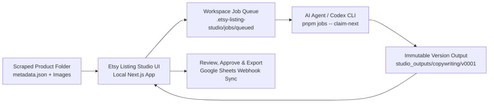

# Etsy Listing Studio

[](LICENSE)
[](https://nodejs.org)
[](#prerequisites)
[](https://www.typescriptlang.org)

**Etsy Listing Studio** is a Windows-first, local-only product listing workbench designed for e-commerce operators, dropshippers, and handmade sellers. It bridges scraped or supplier product folders with local AI agents (such as Codex, Claude, or local LLMs) to generate evidence-backed, high-converting Etsy listings—without cloud lock-in or leaking proprietary data.

---

## 🌟 Key Highlights

- **🔒 100% Local & Private**: All product images, supplier metadata, generated listings, and workspace configs remain strictly on your local disk.
- **🧠 Evidence-Led Copywriting**: Differentiates supplier specifications, printed image facts, and visual observations from unknowns. Never hallucinates product dimensions or unsupported claims.
- **⚡ Operator-Triggered Job Lifecycle**: The browser UI prepares structured JSON job manifests; AI agents process queued jobs on explicit operator demand via CLI.
- **📊 13-Column Google Sheets Integration**: Real-time sync with automatic multi-shop tab routing, auto-tab creation, in-place row updates, and in-order numerical sorting (e.g., `#6` places above `#7`).
- **🔄 Versioned Output & Targeted Tweaks**: Generates immutable listing versions (`v0001`, `v0002`) and allows targeted single-field refinements while preserving the master evidence ledger.
- **🛡️ Immutable Source Guarantees**: Source supplier folders and `metadata.json` files are strictly read-only and never modified or overwritten.

---

## 🏗️ Architecture & Workflow



### 1. Product Ingestion & Discovery
The studio recursively discovers product folders containing a `metadata.json` file inside your chosen workspace root, parsing source titles, prices, image sets (main, variation, description), and technical specifications.

### 2. Job Queueing
In the web UI, select products, inspect images, assign custom product notes or reference images, and queue a copywriting batch. The studio creates versioned JSON manifests under `.etsy-listing-studio/jobs/queued/`.

### 3. Agent Job Processing
Your local AI agent (e.g. Codex) claims jobs using the deterministic lifecycle CLI:
```powershell
pnpm jobs -- claim-next
pnpm jobs -- complete <job-id> <draft-json-path>
```
The processor reads local image evidence and supplier metadata, generates customer-facing storytelling, SEO titles, 13 tags, and taxonomy categories, then writes immutable results to `studio_outputs/copywriting/vNNNN/`.

### 4. Review, Tweak & Google Sheets Sync
Review outputs side-by-side with original photos, approve or reject listings, trigger targeted field tweaks, and sync directly to Google Sheets with 1-click multi-shop routing.

---

## 📋 Prerequisites

| Requirement | Minimum Version | Notes |
|---|---|---|
| **Operating System** | Windows 10 / 11 | Windows-first file paths and lock handling |
| **Node.js** | `>= 22.13.0` | Recommended LTS from [nodejs.org](https://nodejs.org) |
| **pnpm** | `11.x` (or `npm`) | `npm install -g pnpm` |
| **AI Agent (Optional)** | Codex / Claude Code / CLI | For automated job queue processing |

---

## 🚀 Quick Start

### 1. Clone & Install

```powershell
git clone https://github.com/Tjay003/EtsyListingStudioCodex.git
cd EtsyListingStudioCodex
pnpm install
```

### 2. Launch the Studio

**Option A — 1-Click Windows Launcher:**
Double-click `Start Etsy Listing Studio.cmd` in the root folder. It automatically verifies dependencies, starts the local server on `http://127.0.0.1:3000`, and opens your default browser.

**Option B — Terminal:**
```powershell
pnpm dev
```
Open [http://127.0.0.1:3000](http://127.0.0.1:3000) in your browser.

---

## 📁 Local Data Layout

Source product folders are treated as immutable evidence:

```text
my-products-workspace/
├── [001] ceramic-coffee-mug/
│   ├── metadata.json              # Scraped supplier details & specs
│   ├── main_images/               # Primary gallery images
│   ├── variation_images/          # Variant photos (colors, sizes)
│   ├── description_images/        # Infographics & detail shots
│   ├── .etsy-studio.json          # Studio metadata (reference image, notes)
│   └── studio_outputs/            # Generated outputs
│       └── copywriting/
│           ├── v0001/
│           │   ├── listing.json   # Full structured output
│           │   ├── listing.txt    # Clean text representation
│           │   └── review.json    # Approval status & review notes
│           └── v0002/
└── .etsy-listing-studio/          # Workspace control data
    ├── jobs/                      # queued / processing / completed / failed
    ├── batches/                   # Batch manifests
    ├── settings/
    │   └── copywriting.json       # Workspace voice & webhook settings
    └── trash/                     # Safe soft-delete location
```

---

## 📊 Google Sheets Multi-Shop Sync

Etsy Listing Studio includes an Apps Script webhook template supporting **multi-shop tab routing**, **in-place row deduplication**, and **in-order numerical placement**.

### Setup in 4 Steps:
1. Open your Google Spreadsheet and go to **Extensions** > **Apps Script**.
2. Paste the script from [`scripts/google-sheets-apps-script.js`](scripts/google-sheets-apps-script.js).
3. Click **Deploy** > **New deployment** > Select type: **Web app** > Set access to **Anyone** > Deploy.
4. Paste the Web App URL into **Studio Settings** under **Google Sheets Webhook URL**.

### 13-Column Listing Schema:
| # | Column Name | Description |
|---|---|---|
| 1 | `ID` | Numerical / folder ID (e.g. `001`) |
| 2 | `Title` | Original source/scraped product title |
| 3 | `Link` | Supplier source URL (AliExpress, etc.) |
| 4 | `Edited Photo Ready?` | Interactive checkbox for photo status |
| 5 | `Status` | Dropdown (`Draft`, `Approved`, `Published`, `Archived`, `Rejected`) |
| 6 | `Category` | Etsy taxonomy path |
| 7 | `Etsy Title` | 140-char SEO optimized title |
| 8 | `Description` | Narrative story + supported specs |
| 9 | `Tags` | 13 comma-separated Etsy tags |
| 10 | `Aliexpress Price` | Raw supplier price |
| 11 | `Quotation Price` | Target retail price |
| 12 | `Folder Name` | Local folder name |
| 13 | `Last Synced` | Timestamp of last sync |

For comprehensive documentation, see [`docs/GOOGLE_SHEETS_SETUP.md`](docs/GOOGLE_SHEETS_SETUP.md).

---

## 🤖 Processing Jobs with AI Agents

When jobs are queued in the UI, you can process them using the CLI:

```powershell
# List all active jobs across states
pnpm jobs -- list

# Claim the next queued job
pnpm jobs -- claim-next

# Get full context (metadata, settings, notes, images) for a job
pnpm jobs -- context <job-id>

# Report step progress
pnpm jobs -- progress <job-id> <stage> <percent> "<message>"

# Complete a job with draft JSON
pnpm jobs -- complete <job-id> <path-to-draft.json>

# Fail or cancel a job
pnpm jobs -- fail <job-id> "<error-message>"
pnpm jobs -- cancelled <job-id>
```

---

## 🛠️ Developer & Quality Commands

```powershell
# Run test suite
pnpm test

# Run TypeScript static analysis
pnpm typecheck

# Run ESLint validation
pnpm lint

# Production build
pnpm build

# Start production server
pnpm start
```

---

## 🔒 Safety, Privacy & Design Principles

1. **Zero Cloud Lock-in**: No mandatory accounts, external databases, or third-party cloud trackers.
2. **Untrusted Workspace Security**: All file operations resolve within the active workspace root and reject path traversal (`../`) and symlink escapes.
3. **Immutable Originals**: Scraper files and original images are never altered or deleted. Deleted items are safely quarantined in `.etsy-listing-studio/trash/`.
4. **Evidence Transparency**: Generated listings record full evidence ledgers, including inspected images, supplier claims, and unresolved omissions.

---

## 📄 License

This project is licensed under the [MIT License](LICENSE).
