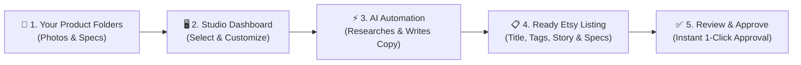
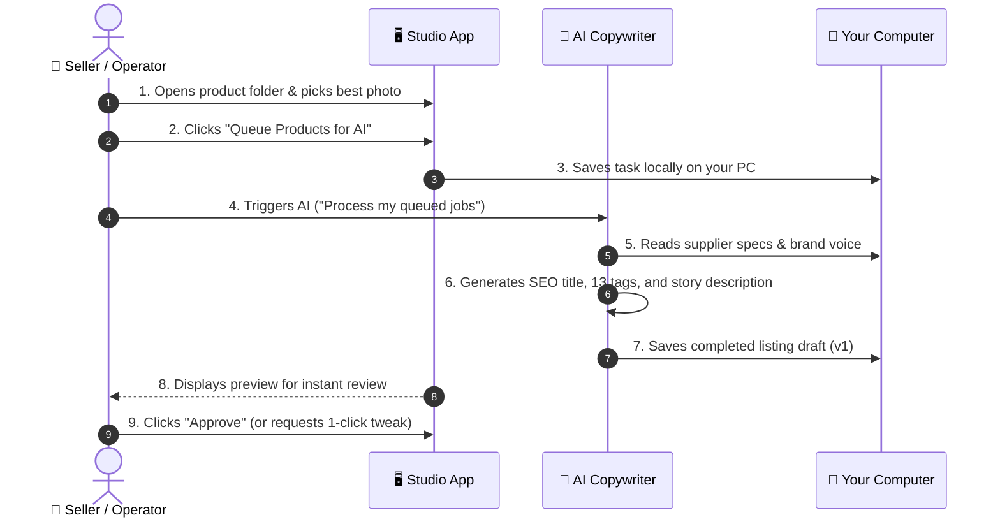
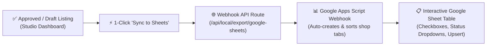

# Etsy Listing Studio — Automated Copywriting Workflow

An automated, privacy-first studio that transforms raw product photos and supplier data into ready-to-publish Etsy listings using AI.

---

## 1. How It Works (Simple Overview)



---

## 2. Step-by-Step User Journey



---

## 3. Key Features & Business Benefits

| Feature | What It Does | Why It Matters |
| :--- | :--- | :--- |
| **🔒 100% Local & Private** | All photos and data stay on your computer. | No cloud monthly database costs, zero data leaks. |
| **🎯 Zero Hallucinations** | AI only writes facts found in your files. | Prevents fake product claims and customer returns. |
| **📈 SEO Optimized** | Formats titles & 13 tags within Etsy's strict rules. | Ranks higher on Etsy, Google, and Pinterest. |
| **🔄 Version History** | Keeps every draft so you can compare and tweak. | Never lose previous copywriting versions. |
| **⚡ Human in the Loop** | You retain 100% final approval on price & copy. | Perfect balance of speed and brand quality. |

---

## 4. What The AI Delivers For Each Product

```text
📁 Your Product Folder
└── 📂 studio_outputs/copywriting/v0001/
    ├── 📄 listing.json   → Etsy Title, Category, 13 SEO Tags, and Description
    ├── 📄 evidence.json  → Fact matrix proving every claim from your supplier data
    └── 📄 review.json    → Your approval status (Approved / Needs Review)
```

---

## 5. Google Sheets Export & Multi-Shop Tracking



- **Multi-Shop Tabs**: Automatically routes to the shop's tab (e.g. `testingFolder1`), creating and formatting new tabs on demand.
- **In-Place Updates**: Re-syncs update existing rows in-place rather than creating duplicates.
- **In-Order Sorting**: Maintains strict numerical ordering (e.g. inserting item 6 automatically places it above item 7).
- **Interactive Controls**: Column 4 has clickable checkboxes for `Edited Photo Ready?`; Column 5 has native dropdown options (`Draft`, `Approved`, `Published`, `Archived`, `Rejected`).

